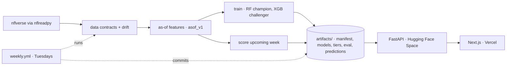
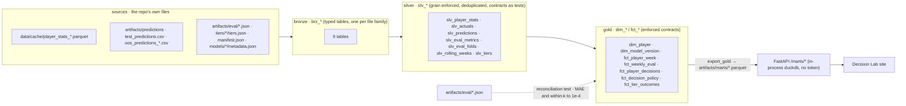

<!-- The YAML block above is Hugging Face Space configuration. This README is mirrored to the
     Space (cbratkovics/fantasy-football-ai) by the weekly job, so the block must stay. -->

<p align="center">
  
</p>

<h1 align="center">Fantasy Football Projections</h1>

<p align="center">
  <strong>An evidence-first ML pipeline.</strong><br>
  The model is deliberately simple. The evaluation harness is the product.
</p>

<p align="center">
  <a href="https://github.com/cbratkovics/fantasy-football-ai/actions/workflows/ci.yml"></a>
  <a href="https://github.com/cbratkovics/fantasy-football-ai/actions/workflows/weekly.yml"></a>
  <a href="LICENSE"></a>
  
  
  
  
  
  
</p>

<p align="center">
  <a href="https://fantasy-football-ai.vercel.app"><b>Live demo</b></a> ·
  <a href="https://cbratkovics-fantasy-football-ai.hf.space/docs"><b>API docs</b></a> ·
  <a href="docs/MODEL_CARD.md"><b>Model card</b></a> ·
  <a href="https://cbratkovics.github.io/fantasy-football-ai/"><b>dbt docs</b></a> ·
  <a href="docs/ARCHITECTURE.md"><b>Architecture</b></a> ·
  <a href="docs/DECISIONS.md"><b>Decisions</b></a> ·
  <a href="AUDIT.md"><b>Audit</b></a>
</p>

---

Weekly NFL fantasy-point projections for QB / RB / WR / TE, built so that **every number can be
traced to the artifact that produced it**: a random-forest model per position, strictly lagged
features with a leakage test on real data, evaluation on two complete seasons against a baseline
that cannot see the future, and a GitHub Actions job that re-scores each week and decides on its
own whether to **publish**, **hold**, or **promote** a challenger.

<table>
  <tr>
    <th align="left">🧮 Model</th>
    <th align="left">🧪 Evidence</th>
    <th align="left">⚙️ Operations</th>
    <th align="left">🏛️ Warehouse</th>
  </tr>
  <tr>
    <td valign="top">One as-of feature module (65 lagged features) · RandomForest champion, XGBoost challenger, per position · residual-quantile floor / ceiling · GMM preseason draft tiers</td>
    <td valign="top">Frozen 2024 test season · full 2025 season scored out of sample · causal trailing-mean baseline · rolling-origin folds · every figure is a JSON artifact with input hash, commit, and metric definitions</td>
    <td valign="top">Weekly job: data contracts → drift (PSI) → score → shadow-evaluate → publish / hold / promote · stateless FastAPI reading committed artifacts · no database, cache, secrets, or LLM</td>
    <td valign="top">dbt Core + dbt-duckdb medallion (bronze → silver → gold) on MotherDuck's free tier · contracts as dbt tests · enforced gold contracts · a reconciliation test that fails the build if a mart disagrees with a published artifact · marts exported to parquet for the API</td>
  </tr>
</table>

---

## Results

Both evaluations score the **same frozen artifact** (`20260911-asof_v1-d333de20`). 2024 was the
held-out test season at training time; 2025 was scored afterwards with no training, tuning, or
selection decision ever touching it. The baseline is a causal trailing mean of each player's
earlier realized points — what a careful person with a spreadsheet would do.

| Season · kind | n (player-games) | MAE model | MAE baseline | Δ | within ±3 model | within ±3 baseline | rolling-origin MAE (17 folds) |
|---|---:|---:|---:|---:|---:|---:|---:|
| **2025** · out-of-sample season | 5,914 | **4.49** | 4.80 | −0.31 | **46.0%** | 43.2% | **4.44** vs 5.18 |
| **2024** · frozen test season | 5,747 | **4.55** | 4.86 | −0.31 | **44.9%** | 42.4% | **4.52** vs 5.27 |

By position, 2025 (model vs baseline MAE): QB 6.63 vs 7.08 · RB 4.54 vs 4.79 · WR 4.36 vs 4.76 · TE 3.59 vs 3.75.

> This is a modest, consistent edge over a strong baseline on a noisy target, not a breakthrough:
> a player's weekly PPR score has a standard deviation of about 8 points (2019–2025 player-games).
> Figures are copied from `artifacts/eval/eval-…-rf.json` and `…-rf-oos2025.json` as of
> 2026-09-11; [**docs/MODEL_CARD.md**](docs/MODEL_CARD.md) is regenerated from the artifacts and
> is canonical.

---

## How the numbers are earned

| | |
|---|---|
| 🔒 **No leakage, by construction and by test** | Every feature for target week *t* is computed from games strictly before *t*, shifted inside the player's history. `tests/test_asof_no_leakage.py` recomputes 200 random real rows from scratch using only earlier games and asserts equality, then perturbs the target week's stats and asserts nothing changes. |
| 🧩 **One feature module** | Training, evaluation, and serving all call `ffai/features/asof.py` (`asof_v1`: 65 lagged features — QB 44 / RB 40 / WR 27 / TE 27). There is no second implementation to drift. |
| 🧾 **Scoring reconciled to the cent** | Standard, half-PPR, and PPR are computed from explicit rules and checked row-for-row against nflverse's own `fantasy_points` / `fantasy_points_ppr`: exact match on all 34,293 rows 2019–2024, and again on 2025. Half-PPR is a rule, not a multiplier. |
| ⏳ **Temporal validation only** | Train 2019–2022, validate 2023, test 2024; then rolling-origin folds inside each evaluated season (refit on everything strictly before a week, score that week). Never a random split. |
| 🧭 **A baseline that can't see the future** | The causal trailing mean adds a week's outcomes only after that week is scored. Beating a position mean is easy; beating this is meaningful. |
| 📦 **Artifacts, not claims** | Each evaluation is one JSON with the input SHA-256, code commit, split, metric definitions, cohorts, and folds. The API serves it verbatim; the UI cannot display a figure that isn't in it. The model card is generated from the same files. |

---

## What runs every Tuesday

`.github/workflows/weekly.yml` runs during the season and commits its results.

```
nflverse pull ─▶ data contracts ─▶ drift (PSI) ─▶ as-of features ─▶ score champion
                     │ fail            │ broad shift          │
                     ▼                 ▼                      ▼
                    HOLD              HOLD          shadow-score challenger ─▶ PUBLISH / PROMOTE
```

1. **Pull** the latest weekly stats from nflverse; rows of the week being scored are dropped (they are incomplete by definition).
2. **Data contracts** — dbt tests on the silver layer, run against MotherDuck: grain uniqueness (player × season × week), freshness through the expected week, null and range checks, row count vs prior week, scoring reconciliation. Failure → `HOLD`, naming the missing week.
3. **Drift** — PSI per monitored feature over the last four played weeks against week-of-season-matched training deciles. Broad shift → `HOLD`; single-feature shift → warn. The first rule written held 47 of 60 normal backtest windows; the current thresholds were calibrated on those windows ([ADR-0010](docs/DECISIONS.md)).
4. **Score** the upcoming week with the champion.
5. **Score last week's actuals** against last week's predictions; append to the season's rolling evaluation.
6. **Shadow-score** the XGBoost challenger. **Promote** only if it beats the champion for four consecutive weeks *and* on the frozen test season.
7. **Publish** — write `artifacts/manifest.json` and `artifacts/predictions/<season>/week_NN.json`, regenerate the model card, run the full dbt build on MotherDuck (gold contracts + the artifact reconciliation), export the gold marts to `artifacts/marts/*.parquet`, commit, and mirror to the Hugging Face Space. A `HOLD` opens a GitHub Issue with the diagnosis; a warehouse failure after scoring fails the run before anything is committed.

The policy is pure Python, unit-tested on synthetic run logs for the publish / hold-contract / hold-drift / promote cases. No LLM is involved anywhere.

---

## Architecture



```
ffai/            data/ (loader, contracts wrapper) · features/asof.py · scoring.py · models/ (train, tiers, registry)
                 eval/ (evaluator, drift, model card) · pipeline/ (weekly job) · serve/ (FastAPI + marts)
dbt/             ffai_dbt — bronze / silver / gold models, tests, macros, exposures (dbt Core + dbt-duckdb)
artifacts/       committed, versioned: manifest.json · models/<version>/ · tiers/<version>/ · eval/<eval_id>.json · predictions/<season>/ · marts/*.parquet
frontend-next/   Next.js 14 — reads only the API
tests/           88 tests: leakage, grain, scoring, contracts wrapper, evaluator, drift, registry, tiers, API contract (incl. marts), weekly policy, interfaces + schemas, config mirrors, dbt incremental equivalence
docs/            MODEL_CARD (generated) · ARCHITECTURE · DECISIONS · DATA_SOURCES · REBUILD_REPORT · case study
```

Serving image: `python:3.11-slim`, 9 runtime packages, artifacts loaded from the repo at startup.
Details in [docs/ARCHITECTURE.md](docs/ARCHITECTURE.md).

---

## Analytics warehouse

A dbt medallion project (`dbt/`, **dbt Core 1.12 + dbt-duckdb**) turns the repository's own files
into a warehouse: developed against a local DuckDB file, deployed to **MotherDuck** (free tier:
10 GB, 10 compute-hours/month; one build per week uses minutes of it). The warehouse computes
*evaluation and decision* marts; model features stay in the one Python feature module.



| Layer | What it guarantees |
|---|---|
| **Bronze** | Nine sources declared once with descriptions and freshness; each copied into a typed table so MotherDuck holds every input and downstream layers never touch files. |
| **Silver** | Grain uniqueness at every table; the former Python data contracts are now dbt tests (`unique_combination_of_columns`, `expect_column_values_to_be_between`, `accepted_values`, `not_null`, a custom `row_count_within_pct_of_prior_period`, var-driven freshness and row-count tests) plus a singular test that the SQL scoring macro reproduces nflverse's points on every row. The weekly job runs `dbt build --select +tag:silver` and HOLDs on failure. |
| **Gold** | Every model has `contract: enforced` with DuckDB-enforced not-null / primary-key / check constraints and a description per column. `fct_weekly_eval` recomputes MAE and within-±k in SQL from `fct_player_week`; `fct_decision_policy` sweeps a floor policy over a threshold grid. |
| **Reconciliation** | `tests/gold/assert_marts_reconcile_to_eval_artifacts.sql`: for every committed evaluation artifact and cohort, the n-weighted aggregate of the marts must match the published n exactly and MAE / within-3 / within-5 to 1e-4, or the build fails. The marts never replace the artifacts; they must agree with them. |
| **Depth** | `slv_player_stats` is incremental (delete+insert, 4-period restatement lookback, equivalence proven by `tests/test_dbt_incremental.py`); `snp_player` is an SCD2 snapshot of the player dimension with `dim_player_current` / `dim_player_asof` views; `fct_decision_policy` is versioned (v1 served, v2 additive) and the API pins the version it reads; pull requests run slim CI (`state:modified+` with `--defer` to the cached `main` dev build). |
| **Counts** | 26 models · 1 snapshot · 97 data tests · 3 unit tests (scoring rules, prediction dedup, weekly-eval metrics) · 8 singular tests · 2 exposures (`api`, `decision_lab_site`). |

`make dbt-dev` builds and tests locally; `make dbt-prod` needs `MOTHERDUCK_TOKEN`; `make dbt-export`
writes the parquet marts the API reads. CI builds the `dev` target from the committed fixture,
lints with `sqlfluff` (dbt templater), and publishes `dbt docs` to
[GitHub Pages](https://cbratkovics.github.io/fantasy-football-ai/). Design records:
[ADR-0013 … ADR-0027](docs/DECISIONS.md).

---

## API

| Endpoint | Returns |
|---|---|
| `GET /health` | model, feature, and tier versions · registered evaluations · data-through week |
| `GET /predictions/{season}/{week}?scoring=ppr\|half\|standard&position=` | predictions with floor / ceiling (validation-residual quantiles) and model version |
| `GET /players/{player_id}` | prediction-vs-actual history (frozen test, out-of-sample, weekly) |
| `GET /tiers/{position}` | preseason GMM draft tiers with their honest evaluation |
| `GET /performance` · `GET /performance/{eval_id}` | the evaluation artifacts, verbatim |
| `GET /manifest` | current champion / challenger / tier versions and the last run |
| `GET /marts/weekly_eval` · `GET /marts/player_week/{player_id}` · `GET /marts/decisions?min_floor=` | gold marts exported by the weekly dbt build (parquet, read in-process), each response carrying its export provenance |

Interactive docs at [`/docs`](https://cbratkovics-fantasy-football-ai.hf.space/docs).

---

## Run locally

```bash
make install                    # uv venv, training deps, editable install (Python 3.11)
make test                       # 68 tests, offline: committed 40-player fixture + committed artifacts
FFAI_TEST_DATA=full make test   # the same tests on the full 2019–2024 pull

make api                        # FastAPI on :7860, loading committed artifacts
make frontend                   # Next.js on :3000 (NEXT_PUBLIC_API_URL=http://localhost:7860)

make train && make evaluate     # retrain → new versioned artifact → frozen-test evaluation + model card
make evaluate ARGS="--kind out_of_sample_season --season 2025"
make tiers SEASON=2024          # compares against the manifest's tiers; --update-manifest to adopt
make weekly                     # dry run of the weekly job
make dbt-dev                    # dbt deps + build + test the medallion warehouse locally (.duckdb/)
make dbt-prod                   # the same against MotherDuck (export MOTHERDUCK_TOKEN=...)
make dbt-export DBT_TARGET=prod # COPY every gold table to artifacts/marts/*.parquet
```

Docker: `docker build -t ffai . && docker run -p 7860:7860 ffai` · `docker compose up` runs API + frontend.

<details>
<summary><b>Deployment</b></summary>

* **API** — Hugging Face Space `cbratkovics/fantasy-football-ai` (Docker SDK, port 7860), a mirror of
  `main`'s working tree including `artifacts/`, refreshed by the weekly job after every
  `PUBLISH` / `PROMOTE` and on demand by the `deploy-space` job in `ci.yml` (both need the
  `HF_TOKEN` repository secret).
* **Frontend** — Vercel project `fantasy-football-ai` (root `frontend-next`, production branch
  `main`) with `NEXT_PUBLIC_API_URL` set to the Space URL.
* **Warehouse** — MotherDuck database `ffai` (schemas `bronze`, `silver`, `gold`), rebuilt by
  the weekly job with the `MOTHERDUCK_TOKEN` repository secret; the API never connects to it.
* **dbt docs** — GitHub Pages, published by `ci.yml` on every push to `main`.
* Nothing else runs anywhere.
</details>

---

## Draft tiers

Per position: prior-season aggregates → StandardScaler → PCA (≥ 90 % variance) → Gaussian
mixture with components chosen by BIC, capped at one component per eight players. Tiers are
evaluated by Spearman correlation between tier rank and realized rank and by within-band rate; a
new tier artifact replaces the old one only if it is not worse on both. Numbers are in the
[model card](docs/MODEL_CARD.md).

## Limitations

* Features are the player's own prior production only: no opponent, injury, depth chart, weather,
  or market inputs. The model is blind to a Friday injury report.
* Players with no prior stat row get no prediction; rookies get no tier.
* Floor / ceiling are residual quantiles; their empirical coverage is not yet tracked weekly.
* The weekly job scores, monitors, and promotes; it does not retrain. Retraining is `make train`.
* Predictions depend on nflverse publishing; a late feed holds the run by design.

## Data and provenance

nflverse weekly player stats, schedules, and rosters via `nflreadpy`, cached locally as parquet;
no other source ([docs/DATA_SOURCES.md](docs/DATA_SOURCES.md)).

This repository was rebuilt in September 2026 after a read-only audit of the previous version
([AUDIT.md](AUDIT.md)) found metrics that weren't traceable to code and models that weren't wired
to the API. The rebuild put the evaluation layer first; what was built and what remains is in
[docs/REBUILD_REPORT.md](docs/REBUILD_REPORT.md). The audit stays in the repo because finding and
fixing that is the most useful thing the project demonstrates.

## License

MIT. Data © nflverse under its own terms.
