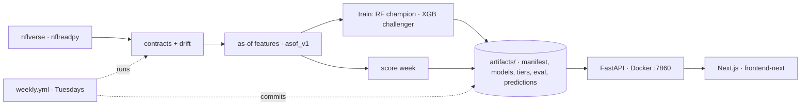

# Fantasy Football AI — artifact-backed weekly projections

> **In one paragraph.** A weekly NFL fantasy projection system rebuilt around evidence: one as-of
> feature module shared by training, evaluation, and serving; RandomForest champion models with an
> XGBoost challenger per position; preseason GMM draft tiers; a forward-time evaluator with a causal
> baseline and rolling-origin folds; a $0/month FastAPI server that only reads committed, versioned
> artifacts; and an autonomous weekly GitHub Actions job that ingests nflverse data, checks contracts
> and drift, scores the champion, shadow-scores the challenger, and publishes, holds, or promotes by a
> deterministic rule. Every number in the docs and UI is read from a committed evaluation artifact
> that records the dataset hash, split, baseline, metric definition, and code commit.

The audit that motivated this rebuild is in [`AUDIT.md`](AUDIT.md); the decisions are in
[`docs/DECISIONS.md`](docs/DECISIONS.md); what was built and what remains is in
[`docs/REBUILD_REPORT.md`](docs/REBUILD_REPORT.md).

## What it does

* Predicts regular-season **PPR points for a player's next game** (QB/RB/WR/TE) from that player's
  own prior weeks only. Standard and half-PPR are derived by the same scoring rules, not multipliers.
* Publishes **preseason draft tiers** per position from prior-season aggregates.
* Serves predictions, tiers, player history, and the full evaluation artifact over a read-only API.
* Re-scores itself every week in CI and commits the results.

## Architecture



Details: [`docs/ARCHITECTURE.md`](docs/ARCHITECTURE.md).

## Data and licence

The only data source is nflverse (weekly player stats, schedules, rosters) via `nflreadpy`, cached
locally as parquet. Scoring rules are reconciled row-for-row against nflverse's own
`fantasy_points` / `fantasy_points_ppr`. See [`docs/DATA_SOURCES.md`](docs/DATA_SOURCES.md) for the
columns used and the licence statement.

## How the numbers are produced

No performance figure is written by hand. `scripts/train.py` records dataset hash, seasons, and
per-position validation/test MAE in `artifacts/models/<version>/metadata.json`;
`scripts/evaluate.py` evaluates the champion on the frozen 2024 season against a causal
trailing-mean baseline, runs rolling-origin folds, writes `artifacts/eval/<eval_id>.json`, and
renders [`docs/MODEL_CARD.md`](docs/MODEL_CARD.md) with the JSON key next to every figure. The API's
`/performance` endpoint returns that same artifact, and the frontend renders it.

Leakage is prevented by construction (every feature is computed on a series already shifted within
the player's history) and verified on real data by `tests/test_asof_no_leakage.py`.

## Run locally

```bash
# Python 3.11
make install                      # uv venv + training/dev deps + editable install
make test                         # offline: committed 40-player fixture
FFAI_TEST_DATA=full make test     # same tests on the full 2019-2024 pull (network on first run)

make api                          # http://127.0.0.1:7860/health  (reads artifacts/manifest.json)
make frontend                     # http://localhost:3000  (NEXT_PUBLIC_API_URL=http://localhost:7860)

# Retrain / re-evaluate / score (all write to artifacts/)
make train
make tiers SEASON=2024
make evaluate
make score SEASON=2025 WEEK=1 THROUGH=2024
make weekly                       # dry-run of the autonomous job
```

Docker: `docker build -t ffai-api . && docker run -p 7860:7860 ffai-api` (API only, non-root,
port 7860 for Hugging Face Spaces). `docker compose up` runs API + frontend.

## The weekly job

`.github/workflows/weekly.yml` runs `ffai/pipeline/weekly.py` on Tuesdays during the season
(and on demand): load stats through the last completed week → data contracts → PSI drift check
→ build as-of features → score the champion → attach last week's actuals and append to the rolling
evaluation → shadow-score the challenger → apply the policy (`PUBLISH` / `HOLD` / `PROMOTE`) →
update `artifacts/manifest.json` and regenerate the model card → commit. A `HOLD` opens a GitHub
issue with the run log. The policy is pure Python and unit-tested (`tests/test_weekly_policy.py`).

## Repository layout

```
ffai/            package: config, data/, scoring, features/asof.py, models/, eval/, pipeline/, serve/
artifacts/       committed, versioned: manifest.json, models/, tiers/, eval/, predictions/
scripts/         thin CLIs: train, tiers, evaluate, score_week, run_weekly
tests/           scoring reconciliation, leakage, grain, contracts, evaluator, drift, registry, API, policy
docs/            ARCHITECTURE, DATA_SOURCES, DECISIONS, MODEL_CARD (generated), REBUILD_REPORT, case study
frontend-next/   Next.js 14 app that only calls the API
.github/         ci.yml (lint, tests, import check, docker build) · weekly.yml
```

## Limitations

* Features are the player's own production only; no opponent, injury, weather, depth-chart, or
  market inputs. Players with no prior stat row get no prediction.
* Weekly fantasy scores are noisy; see the model card for error magnitudes and the baseline
  comparison before relying on any single projection.
* Models are not retrained automatically; drift is monitored and the job holds publication when
  inputs shift materially.
* Not for betting.

## Licence

MIT (see `LICENSE`). Data: nflverse, CC-BY-4.0.
