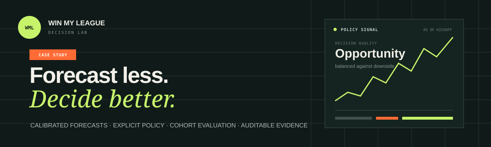
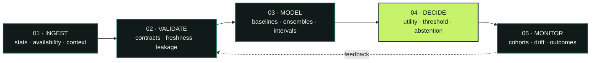

<p align="center">
  
</p>

<p align="center">
  <a href="https://fantasy-football-ai.vercel.app"></a>
  <a href="docs/PORTFOLIO_CASE_STUDY.md"></a>
  <a href="LICENSE"></a>
</p>

<p align="center">
  <strong>An end-to-end decision-science system disguised as a fantasy-football app.</strong><br />
  Forecast outcomes. Quantify uncertainty. Apply an explicit policy. Measure whether the decision helped.
</p>

---

## The decision—not just the prediction

Most ML projects stop at a score. **Win My League starts there.** It turns noisy, time-sensitive signals into ranked and explainable lineup actions, then evaluates the trade-off between opportunity, coverage, and downside.

The sports domain is intentionally low-risk; the workflow maps directly to real decision systems with entity-level scores, asymmetric errors, policy thresholds, cohort monitoring, and decisions that must be explained.

<table>
<tr>
<td width="33%"><strong>01 · ESTIMATE</strong><br><br>Position-specific forecasts and uncertainty from information available before the decision.</td>
<td width="33%"><strong>02 · DECIDE</strong><br><br>A configurable policy separates model output from the action a user should take.</td>
<td width="33%"><strong>03 · EVALUATE</strong><br><br>Forward-time tests compare error, coverage, regret, and downside across cohorts.</td>
</tr>
</table>

> [!IMPORTANT]
> **Evidence over theater.** Repository fixtures and UI examples are demo data—not measured production results. A metric becomes a portfolio claim only when an evaluation artifact records its input hash, time split, baseline, model version, and definition.

## See it in action

The interactive portfolio makes the system legible to both technical and product audiences:

- **Policy simulator** — move the recommendation threshold and watch coverage/downside change.
- **Evaluation workbench** — compare accuracy, tier agreement, and MAE by position cohort.
- **System narrative** — follow the path from raw event through validation, modeling, decision, and monitoring.
- **Technical brief** — inspect design choices, limitations, metric definitions, and the production path.

<p align="center">
  <a href="https://fantasy-football-ai.vercel.app"><strong>Open the live Decision Lab →</strong></a>
  &nbsp;&nbsp;·&nbsp;&nbsp;
  <a href="https://fantasy-football-ai.vercel.app/performance"><strong>Inspect evaluation →</strong></a>
</p>

## System at a glance



| Layer | What is here | Maturity |
|:--|:--|:--:|
| **Experience** | Next.js portfolio, policy simulator, projections, tiers, evaluation | ✅ Implemented |
| **Evaluation** | Forward-time holdout, causal baseline, cohorts, policy sweep, evidence manifest | ✅ Implemented CLI |
| **API** | FastAPI routes for players, predictions, tiers, authentication, subscriptions | 🟡 Mixed integration |
| **Modeling** | Feature engineering, position models, ensembles, uncertainty, GMM tiers | 🧪 Prototype modules |
| **Data** | Sleeper, ESPN, and weather adapters plus synthetic fixtures | 🟡 Mixed sources |
| **Operations** | Docker, Railway/Vercel, Alembic, Redis/Celery, Terraform | 🏗️ Scaffolding |

## Run it locally

**Prerequisites:** Node.js 18+ and npm.

```bash
git clone https://github.com/cbratkovics/fantasy-football-ai.git
cd fantasy-football-ai/frontend-next
npm ci
npm run dev
```

Open **[localhost:3000](http://localhost:3000)**. Authentication-backed routes require the Clerk environment values documented in [`frontend-next/VERCEL_ENVIRONMENT_SETUP.md`](frontend-next/VERCEL_ENVIRONMENT_SETUP.md); the portfolio landing page itself is the primary review experience.

## Reproduce an evaluation

The evaluator is deliberately independent from model training, so a candidate model cannot redefine its own test. Give it a CSV with `player_id`, `season`, `week`, `position`, `prediction`, `actual`, and `decision_score`; `prediction_floor` is optional.

```bash
python -m backend.evaluation.decision_evaluator predictions.csv \
  --test-start 2024-10 \
  --output artifacts/evaluation.json
```

The artifact captures:

```text
input SHA-256       forward-time split       Git commit
causal baseline     position cohorts         threshold-policy metrics
```

<details>
<summary><strong>What every reported experiment should prove</strong></summary>

1. An immutable input snapshot or content hash.
2. Rolling-origin train, validation, and test windows.
3. Naive and frozen expert-ranking baselines.
4. MAE and interval coverage by position and week.
5. Policy coverage, regret, and downside by cohort.
6. Model and feature versions plus one reproduction command.

</details>

## Repository map

```text
fantasy-football-ai/
├── frontend-next/              Next.js product and portfolio experience
│   └── src/
│       ├── app/                Route-level experiences
│       └── components/         Decision, evaluation, and visualization UI
├── backend/
│   ├── api/                    FastAPI route modules
│   ├── data/                   Source adapters and ingestion prototypes
│   ├── evaluation/             Independent evidence-artifact CLI
│   ├── ml/                     Features, models, tiers, and trainers
│   └── services/               Inference, explanation, and integrations
├── analytics/sql/              Decision-performance metric contract
├── infrastructure/             Containers, proxy, and Terraform
└── docs/                       Architecture, deployment, and case-study notes
```

## Technology

<p>
  
  
  
  
  
  
  
  
  
</p>

## Go deeper

| Read | Why |
|:--|:--|
| **[Portfolio case study](docs/PORTFOLIO_CASE_STUDY.md)** | Codebase audit, evaluation design, metric tree, system architecture, and interview narrative |
| **[Deployment guide](docs/DEPLOYMENT.md)** | Hosting topology and deployment workflow |
| **[Project structure](docs/PROJECT_STRUCTURE.md)** | Detailed guide to the repository |
| **[Decision metric contract](analytics/sql/risk_strategy.sql)** | Grain, denominators, policy outcomes, and cohort definitions |

---

<p align="center">
  Built by <a href="https://github.com/cbratkovics"><strong>Christopher Bratkovics</strong></a><br />
  <sub>Transparent assumptions · reproducible evidence · decisions that can be defended</sub><br /><br />
  <a href="LICENSE">MIT License</a>
</p>
