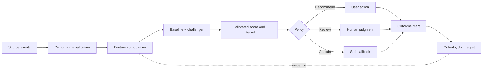

<div align="center">

# Win My League

### Applied decision science for high-uncertainty choices

**A portfolio case study in point-in-time modeling, policy optimization, analytics engineering, and explainable product design.**

[](backend/evaluation/decision_evaluator.py)
[](frontend-next)
[](analytics/sql/risk_strategy.sql)
[](backend)
[](tests/test_decision_evaluator.py)
[](LICENSE)

[Explore the case study](docs/PORTFOLIO_CASE_STUDY.md) · [Review the evaluator](backend/evaluation/decision_evaluator.py) · [Inspect the SQL mart](analytics/sql/risk_strategy.sql) · [Run locally](#run-it-locally)

</div>

---

## The 60-second overview

Most ML demos stop after producing a score. **Win My League starts with the decision.**

The system helps a fantasy manager choose a lineup under incomplete and rapidly changing information. It estimates player outcomes, represents uncertainty, applies an explicit risk policy, and measures whether the resulting action was better than a simple baseline.

Fantasy football is a deliberately low-risk domain, but the analytical pattern transfers to real-time risk work:

| Risk-system concern | Portfolio analogue |
|---|---|
| Score an entity from time-sensitive signals | Forecast a player using only pre-kickoff information |
| Balance approval and loss | Balance recommendation coverage and downside |
| Apply a configurable risk strategy | Convert calibrated scores into recommend/review/abstain actions |
| Diagnose changing populations | Monitor errors and outcomes by position, week, and score band |
| Explain a consequential decision | Surface uncertainty, freshness, drivers, and model/policy versions |

> [!IMPORTANT]
> **Evidence before claims.** UI examples and repository fixtures are labeled demonstrations—not measured production results. A metric becomes a portfolio claim only when its dataset, temporal split, baseline, model version, code commit, and reproduction path are recorded.

## What this project demonstrates

<table>
<tr>
<td width="25%"><strong>Decision science</strong><br/><sub>Separates outcome estimation from policy; makes coverage, downside, and abstention explicit.</sub></td>
<td width="25%"><strong>Applied modeling</strong><br/><sub>Uses temporal validation, causal baselines, position cohorts, uncertainty, and model challengers.</sub></td>
<td width="25%"><strong>Analytics engineering</strong><br/><sub>Defines grains, denominators, point-in-time joins, version dimensions, and dashboard-ready marts.</sub></td>
<td width="25%"><strong>Production thinking</strong><br/><sub>Includes API boundaries, data validation, evidence manifests, caching/queue scaffolding, and containers.</sub></td>
</tr>
</table>

### The question behind the product

> **Who should we act on, at what threshold, and what evidence would change that decision?**

A point forecast alone cannot answer that question. The product treats the decision as an expected-utility problem:

```text
expected utility = expected performance
                 − risk tolerance × downside shortfall
                 − opportunity cost
```

The interactive Decision Lab makes this concrete: moving the policy threshold changes both the number of recommendations and the downside profile of those selections.

## System design



The separation between **model** and **policy** is intentional. A model estimates an outcome distribution; a versioned policy determines the action and can be tuned to different risk tolerances without retraining the model.

## Evaluation that can be audited

The standalone evaluator consumes a prediction CSV instead of importing a training pipeline. This prevents candidate-model code from quietly redefining how it is judged.

It currently provides:

- a forward-time test holdout;
- a trailing-mean baseline that cannot see same-week outcomes;
- MAE and median absolute error for model and baseline;
- position-level cohort results;
- recommendation coverage, selected-population MAE, and downside rate across policy thresholds;
- an immutable evidence manifest containing the input SHA-256, Git commit, generation time, and split definition.

### Input contract

| Column | Meaning | Constraint |
|---|---|---|
| `player_id` | Stable entity identifier | Required |
| `season`, `week` | Decision period | Required; determines temporal ordering |
| `position` | Evaluation cohort | Required |
| `prediction` | Pre-event point estimate | Required; finite numeric value |
| `actual` | Post-event outcome | Required; finite numeric value |
| `decision_score` | Policy score | Required; between `0` and `1` |
| `prediction_floor` | Estimated downside floor | Optional; enables downside-rate evaluation |

```bash
python -m backend.evaluation.decision_evaluator predictions.csv \
  --test-start 2024-10 \
  --output artifacts/evaluation.json
```

The result is a machine-readable artifact suitable for CI checks, dashboard ingestion, or a generated model card.

## Decision-performance metrics

The SQL reference mart declares one row per **UTC decision date × position × model version × policy version**.

| Metric | Definition | Why it belongs beside model error |
|---|---|---|
| Recommendation rate | recommendations / eligible decisions | Prevents apparent quality gains from recommending almost nothing |
| Hit rate | selections above replacement level / selections | Measures useful actions, not merely close forecasts |
| Mean regret | best eligible result − selected result | Quantifies missed opportunity |
| Downside rate | selections below their predicted floor / selections | Exposes asymmetric harm and interval failures |
| Review rate | review actions / eligible decisions | Measures friction imposed on the user |

## Implementation map

| Layer | Key paths | Maturity |
|---|---|---|
| Portfolio product | [`frontend-next/src/components/portfolio`](frontend-next/src/components/portfolio) | **Implemented** |
| Evidence generation | [`backend/evaluation`](backend/evaluation) | **Implemented and tested** |
| Decision analytics | [`analytics/sql/risk_strategy.sql`](analytics/sql/risk_strategy.sql) | **Reference implementation** |
| API surface | [`backend/api`](backend/api) | **Implemented; integration maturity varies** |
| Modeling | [`backend/ml`](backend/ml) | **Prototype modules** |
| Source adapters | [`backend/data`](backend/data) | **Mixed live connectors and demos** |
| Operations | [`infrastructure`](infrastructure), Docker, Railway/Vercel configs | **Deployment scaffolding** |

This vocabulary is deliberate: scaffolding demonstrates design intent; only repeatable tests and artifacts demonstrate operation.

## Run it locally

### Portfolio UI

```bash
cd frontend-next
npm ci
npm run dev
```

Open [`http://localhost:3000`](http://localhost:3000).

### Evaluation tests

From the repository root:

```bash
python -m unittest tests.test_decision_evaluator
```

## Repository guide

```text
.
├── analytics/sql/           # Versioned decision-performance metric contract
├── backend/
│   ├── api/                 # FastAPI route modules
│   ├── data/                # Source adapters and ingestion prototypes
│   ├── evaluation/          # Independent, reproducible evidence generation
│   ├── ml/                  # Feature, model, tier, and training prototypes
│   └── services/            # Inference, explanation, and integrations
├── docs/                    # Technical brief, architecture, and roadmap
├── frontend-next/           # Interactive Next.js portfolio and product views
├── infrastructure/          # Container and cloud deployment scaffolding
└── tests/                   # Focused evaluation-contract tests
```

## What I would build next

1. **Freeze a licensed historical dataset** and document when every input became available.
2. **Extend the evaluator to rolling-origin folds** with an untouched final test season.
3. **Add a frozen expert-ranking baseline** and bootstrap uncertainty by week—not by correlated player row.
4. **Generate a versioned model card** and feed only generated artifacts into the performance UI.
5. **Canonicalize the runtime** by selecting one API entry point, one training path, and one dependency strategy.

I would not add an autonomous agent to the scoring path. If generative AI is added, its narrow role should be translating structured, precomputed drivers into plain language—with schema validation, caching, a token ceiling, and a deterministic fallback.

## Technical brief

The full [portfolio case study](docs/PORTFOLIO_CASE_STUDY.md) covers:

- the codebase audit and credibility gaps;
- metric definitions and temporal evaluation design;
- the point-in-time analytics model;
- production monitoring and rollback strategy;
- a concise interview narrative and discussion prompts.

---

<div align="center">

Built by **Christopher Bratkovics** · [GitHub](https://github.com/cbratkovics) · [LinkedIn](https://linkedin.com/in/cbratkovics)

[MIT License](LICENSE)

</div>
