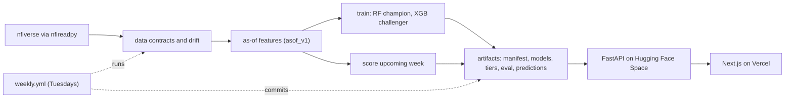

# Fantasy Football Projections — an evidence-first ML pipeline

[](https://github.com/cbratkovics/fantasy-football-ai/actions/workflows/ci.yml)
[](https://github.com/cbratkovics/fantasy-football-ai/actions/workflows/weekly.yml)
[](LICENSE)

**Live demo:** [fantasy-football-ai.vercel.app](https://fantasy-football-ai.vercel.app) · **API:** [cbratkovics-fantasy-football-ai.hf.space/docs](https://cbratkovics-fantasy-football-ai.hf.space/docs) · **Model card:** [docs/MODEL_CARD.md](docs/MODEL_CARD.md)

Weekly NFL fantasy-point projections for QB/RB/WR/TE, built so that every number can be traced to the artifact that produced it. A random-forest model per position, strictly lagged features with a leakage test, evaluation on two complete seasons the model never saw against a causal baseline, and a GitHub Actions job that re-scores each week and decides on its own whether to publish, hold, or promote a challenger. Runs at **$0/month**.

The model is deliberately simple. The evaluation harness is the product.

---

## Results

Both evaluations score the **same frozen artifact** (`20260911-asof_v1-d333de20`). 2024 was the held-out test season at training time; 2025 was scored afterwards with no training, tuning, or selection decision ever touching it. The baseline is a causal trailing mean of each player's earlier realized points — what a careful person with a spreadsheet would do.

| Season · kind | n (player-games) | MAE model | MAE baseline | within ±3 model | within ±3 baseline | rolling-origin MAE (17 folds) |
|---|---:|---:|---:|---:|---:|---:|
| 2025 · out-of-sample season | 5,914 | **4.49** | 4.80 | **46.0%** | 43.2% | **4.44** vs 5.18 |
| 2024 · frozen test season | 5,747 | **4.55** | 4.86 | **44.9%** | 42.4% | **4.52** vs 5.27 |

By position, 2025: QB 6.63 vs 7.08 · RB 4.54 vs 4.79 · WR 4.36 vs 4.76 · TE 3.59 vs 3.75.

This is a modest, consistent edge over a strong baseline on a noisy target, not a breakthrough — weekly fantasy points have a standard deviation around 7. Figures are copied from `artifacts/eval/eval-…-rf.json` and `…-rf-oos2025.json` as of 2026-09-11; [docs/MODEL_CARD.md](docs/MODEL_CARD.md) is regenerated from the artifacts and is canonical.

---

## How the numbers are earned

**No leakage, by construction and by test.** Every feature for target week *t* is computed from games strictly before *t*, shifted inside the player's history. `tests/test_asof_no_leakage.py` recomputes 200 random real rows from scratch using only earlier games and asserts equality, then perturbs the target week's stats and asserts nothing changes.

**One feature module.** Training, evaluation, and serving all call `ffai/features/asof.py` (`asof_v1`: 65 lagged features — QB 44 / RB 40 / WR 27 / TE 27). There is no second implementation to drift.

**Scoring rules reconciled to the cent.** Standard, half-PPR, and PPR are computed from explicit rules and checked row-for-row against nflverse's own `fantasy_points` and `fantasy_points_ppr`: exact match on all 34,293 rows, 2019–2024. Half-PPR is derived from rules, not a multiplier.

**Temporal validation only.** Train 2019–2022, validate 2023, test 2024; then rolling-origin folds inside each evaluated season (refit on everything strictly before a week, score that week). Never a random split.

**A baseline that can't see the future.** The causal trailing mean adds a week's outcomes only after that week is scored. Beating a position mean is easy; beating this is meaningful.

**Artifacts, not claims.** Each evaluation is one JSON with the input SHA-256, code commit, split, metric definitions, cohorts, and folds. The API serves it verbatim; the UI cannot display a figure that isn't in it. The model card is generated from the same files.

---

## What runs every Tuesday

`.github/workflows/weekly.yml` runs during the season and commits its results:

1. Pull the latest weekly stats from nflverse.
2. **Data contracts** — grain uniqueness (player × season × week), freshness, null and range checks, row count vs prior week. Failure → `HOLD`.
3. **Drift** — PSI per monitored feature over the last four played weeks against week-of-season-matched training deciles. Broad shift → `HOLD`; single-feature shift → warn. (The first rule I wrote held 47 of 60 normal backtest windows; the current thresholds were calibrated on those windows — see [ADR-0010](docs/DECISIONS.md).)
4. Build as-of features for the upcoming week and score the champion.
5. Score last week's actuals against last week's predictions; append to the season's rolling evaluation.
6. Shadow-score the XGBoost challenger. **Promote** only if it beats the champion for four consecutive weeks *and* on the frozen test season.
7. Write `artifacts/manifest.json` and `artifacts/predictions/<season>/week_NN.json`, regenerate the model card, commit, and mirror to the Hugging Face Space. A `HOLD` opens a GitHub Issue with the diagnosis.

The policy is pure Python, unit-tested on synthetic run logs for the publish / hold-contract / hold-drift / promote cases. No LLM is involved anywhere.

---

## Architecture



- **`ffai/`** — single Python package: `data/` (loader + contracts), `features/asof.py`, `scoring.py`, `models/` (train, tiers, registry), `eval/` (evaluator, drift, model card), `pipeline/` (weekly job), `serve/` (FastAPI).
- **`artifacts/`** — committed, versioned: `manifest.json`, `models/<version>/` (sklearn pipelines + metadata), `tiers/<version>/`, `eval/<eval_id>.json`, `predictions/<season>/`.
- **`frontend-next/`** — Next.js 14, reads only the API.
- **`tests/`** — 62 tests: leakage, grain, scoring reconciliation, contracts, evaluator, drift, registry, API contract, weekly policy.
- **Serving** — `python:3.11-slim`, 8 runtime packages, no database, no cache, no secrets. Artifacts load from the repo at startup.

Details: [docs/ARCHITECTURE.md](docs/ARCHITECTURE.md) · decisions: [docs/DECISIONS.md](docs/DECISIONS.md)

---

## API

| Endpoint | Returns |
|---|---|
| `GET /health` | model, feature, and tier versions; data-through week; positions loaded |
| `GET /predictions/{season}/{week}?scoring=ppr\|half\|standard&position=` | predictions with floor/ceiling (validation-residual quantiles) and model version |
| `GET /players/{player_id}` | prediction vs actual history |
| `GET /tiers/{position}` | preseason GMM draft tiers |
| `GET /performance` · `GET /performance/{eval_id}` | the evaluation artifacts, verbatim |
| `GET /manifest` | current champion/challenger/tier versions and last run |

Interactive docs at `/docs`.

---

## Run locally

```bash
make install                 # uv venv, training deps, editable install (Python 3.11)
make test                    # 62 tests against a committed 40-player fixture, offline
FFAI_TEST_DATA=full make test  # same tests on the full 2019–2024 pull
make train && make evaluate  # retrain and write a new versioned artifact + evaluation
make api                     # FastAPI on :7860, loading committed artifacts
make weekly                  # dry run of the weekly job
```

Docker: `docker build -t ffai . && docker run -p 7860:7860 ffai`.

---

## Draft tiers

Per position, prior-season aggregates → StandardScaler → PCA (≥90% variance) → Gaussian mixture with components chosen by BIC, capped at one component per eight players. Tiers are evaluated by Spearman correlation between tier rank and realized rank and by within-band rate; a new tier artifact replaces the old one only if it is not worse on both. Numbers in the [model card](docs/MODEL_CARD.md).

---

## Limitations (honest list)

- Features are the player's own prior production only: no opponent, injury, depth chart, weather, or market inputs. The model is blind to a Friday injury report.
- Players with no prior stat row get no prediction; rookies get no tier.
- Floor/ceiling are residual quantiles; their empirical coverage is not yet tracked weekly.
- The weekly job scores, monitors, and promotes; it does not retrain. Retraining is `make train`.
- Predictions depend on nflverse publishing; a late feed holds the run by design.

---

## Data

nflverse weekly player stats, schedules, and rosters via `nflreadpy`, cached locally as parquet. No other source. Column usage and license notes: [docs/DATA_SOURCES.md](docs/DATA_SOURCES.md).

## Provenance

This repository was rebuilt in September 2026 after a read-only audit of the previous version ([AUDIT.md](AUDIT.md)) found metrics that weren't traceable to code and models that weren't wired to the API. The rebuild put the evaluation layer first; what was built and what remains is in [docs/REBUILD_REPORT.md](docs/REBUILD_REPORT.md). The audit stays in the repo because finding and fixing that is the most useful thing the project demonstrates.

## License

MIT. Data © nflverse under its own terms.
