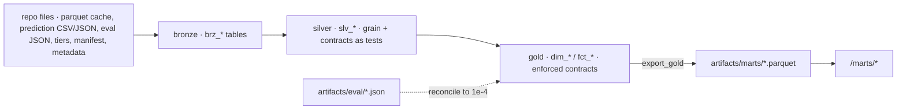

# Architecture

One Python package (`ffai/`), one dbt project (`dbt/`), one set of committed artifacts
(`artifacts/`), one FastAPI server that reads those artifacts, one weekly GitHub Actions job that
refreshes them, and a Next.js frontend that only talks to the API. The only hosted service is
MotherDuck's free tier, which holds the analytics warehouse; serving never touches it.

```mermaid
flowchart LR
  subgraph weekly["GitHub Actions · weekly.yml (Tuesdays in season)"]
    A[nflverse via nflreadpy] --> B[data contracts · dbt silver tests]
    B --> C[drift · PSI vs training deciles]
    C --> D[as-of features · asof_v1]
    D --> E[score champion]
    D --> F[shadow-score challenger]
    E --> G[attach last week's actuals · rolling eval]
    F --> G
    G --> H{policy}
    H -->|PUBLISH / PROMOTE| X[dbt build on MotherDuck · export gold marts]
    X --> I[commit artifacts + manifest + model card + marts]
    H -->|HOLD| J[commit run log · open issue]
  end
  subgraph repo["artifacts/ (committed)"]
    M[manifest.json]
    K[models/&lt;version&gt;/*.pkl + metadata.json]
    T[tiers/&lt;version&gt;]
    V[eval/&lt;eval_id&gt;.json · rolling_&lt;season&gt;.json]
    P[predictions/&lt;season&gt;/week_ww.json]
    Q[marts/*.parquet]
  end
  I --> repo
  repo --> S[FastAPI · ffai.serve · Docker :7860]
  S --> W[Next.js · frontend-next · Vercel]
```

## Modules

| Module | Responsibility | Key invariant |
|---|---|---|
| `ffai/config.py` | paths, seasons, and `PROJECT`: the one project configuration (entity / period / cohorts / target / bands / candidates / deployment names) | no secrets; dbt vars, the frontend config JSON, and the workflow schedule are mirrors checked by `tests/test_project_config.py` (ADR-0028) |
| `ffai/interfaces.py` | the seams a second domain implements: `SourceLoader`, `TargetSpec`, `FeatureModule` | satisfied by `nflverse.LOADER`, `scoring.TARGET_SPEC`, `features.asof` (`tests/test_interfaces.py`) |
| `artifacts/schemas/` | JSON Schemas for the evaluation artifact, manifest, model metadata, scored-period file, drift report | every committed artifact validates in the test suite |
| `ffai/data/nflverse.py` | the only data source; dated parquet cache | every loader returns one row per `(player_id, season, week)` |
| `ffai/data/contracts.py` | runs `dbt build --select +tag:silver` and maps `run_results.json` into the contract report | the checks are dbt tests (ADR-0015); the weekly job HOLDs on any failure |
| `ffai/scoring.py` | standard / half / PPR by explicit rules | reconciles exactly with nflverse (`tests/test_scoring_reconciliation.py`) |
| `ffai/features/asof.py` | **the** feature builder (training, evaluation, serving) | every feature of `(player, season, week)` uses rows strictly earlier; enforced by `tests/test_asof_no_leakage.py` on real data |
| `ffai/models/train.py` | RF champion + XGB challenger per position, season split, intervals, drift reference | pipelines carry `feature_names_in_`; metadata records input sha256 + commit |
| `ffai/models/tiers.py` | preseason GMM tiers (scaler → PCA → GMM, BIC) | inputs are prior-season aggregates only |
| `ffai/models/registry.py` | manifest I/O, champion/challenger slots, `should_promote` | deterministic promotion rule, unit-tested |
| `ffai/eval/evaluator.py` | forward holdout, causal trailing-mean baseline, rolling-origin folds, artifact v2.0 | MAE and within-±3 are computed on the same rows; artifact carries sha256 + commit + metric definitions |
| `ffai/eval/drift.py` | PSI per feature vs training deciles | HOLD when a top-10-importance feature exceeds 0.25 |
| `ffai/eval/model_card.py` | renders `docs/MODEL_CARD.md` from artifacts | every number shows its JSON key |
| `ffai/pipeline/score.py` | score an upcoming week; attach actuals later | targets are stubs with NaN stats; features come from prior rows only |
| `ffai/pipeline/weekly.py` | the autonomous job (ingest → contracts → drift → score → evaluate → policy → commit) | policy is pure Python (`tests/test_weekly_policy.py`) |
| `ffai/serve/app.py` | FastAPI reading `artifacts/manifest.json` at startup | fails fast without a manifest; GET only; every response names model + feature version |
| `ffai/serve/marts.py` | in-process DuckDB over `artifacts/marts/*.parquet` for `/marts/*` | no token, no network; 404 when no marts were exported |
| `dbt/` (`ffai_dbt`) | bronze → silver → gold over the repo's own files; contracts, unit tests, exposures, docs | gold must reconcile to `artifacts/eval/*.json` or the build fails (ADR-0016) |

## Artifact contract

| Path | Written by | Read by |
|---|---|---|
| `artifacts/manifest.json` | `scripts/evaluate.py`, `scripts/score_week.py`, weekly job | API startup, weekly job |
| `artifacts/models/<model_version>/{POS}_{rf,xgb}.pkl`, `metadata.json`, `test_predictions.csv` | `scripts/train.py` | evaluator, API, weekly job |
| `artifacts/tiers/<tier_version>/{model.pkl,tiers.json,metadata.json}` | `scripts/tiers.py` | API |
| `artifacts/eval/<eval_id>.json` | `scripts/evaluate.py` | API `/performance`, model card |
| `artifacts/eval/rolling_<season>.json` | weekly job | model card, promotion rule |
| `artifacts/predictions/<season>/week_<ww>.json` | `scripts/score_week.py`, weekly job | API `/predictions`, `/players` |
| `artifacts/marts/*.parquet`, `_export_manifest.json` | `dbt run-operation export_gold` (weekly job, prod target) | API `/marts/*`, site Decisions panel and player history |
| `docs/MODEL_CARD.md` | `ffai/eval/model_card.py` | humans |

Model versions are `YYYYMMDD-<feature_version>-<input sha256[:8]>`; artifacts are never edited in
place, a new version is written next to the old one and the manifest pointer moves.

## Analytics warehouse (dbt)

* Targets: `dev` = `.duckdb/ffai_dev.duckdb`; `prod` = MotherDuck `md:ffai` (token from
  `MOTHERDUCK_TOKEN`). Schemas are exactly `bronze`, `silver`, `gold` (ADR-0014).
* Sources are the repository's own files through dbt-duckdb `external_location`; bronze copies them
  into tables so MotherDuck holds every input.
* Silver enforces grain (`slv_player_stats` player × season × week; `slv_predictions` player × season
  × week × model_version × candidate; `slv_actuals` adds scoring_format; `slv_eval_metrics` eval_id ×
  cohort; `slv_eval_folds` eval_id × season × week; `slv_tiers` tiers_version × position × player)
  with documented deterministic deduplication; the data contracts are its tests (ADR-0015).
* `slv_player_stats` is incremental (delete+insert on the grain, `stats_lookback_periods`
  restatement lookback, documented full-refresh policy; ADR-0023).
* Snapshot `snp_player` (SCD2, `check` on team / position / display name) feeds the gold views
  `dim_player_current` and `dim_player_asof` (`is_exact_asof` marks periods history can answer;
  ADR-0024). The views are not exported.
* Gold: `dim_player`, `dim_model_version`, `fct_player_week`, `fct_weekly_eval`,
  `fct_player_decisions`, `fct_decision_policy` (versioned: v1 served under the plain relation
  name, v2 additive, API pins `DECISIONS_MART_VERSION`; ADR-0025), `fct_tier_outcomes`; every
  model contracted (ADR-0016, ADR-0017). Unit tests pin the scoring macro, the prediction dedup
  rule, and the weekly-eval metrics. Exposures: `api`, `decision_lab_site`.
* The weekly job runs the silver contracts inside the Python job (HOLD on failure), then after
  scoring `dbt build --target prod` and `export_gold`; CI builds `dev` from the committed fixture
  (full on `main`, `state:modified+ --defer` against the cached `main` build elsewhere; ADR-0026),
  lints with sqlfluff, and publishes `dbt docs` to GitHub Pages (ADR-0019, ADR-0020). The dbt
  toolchain is pinned once in `constraints.txt` (ADR-0027).

## Serving

`Dockerfile` builds `python:3.11-slim` + `requirements-api.txt` + `ffai/` + `artifacts/` and runs
`uvicorn ffai.serve.app:app --port 7860` as a non-root user (Hugging Face Spaces convention).
Startup loads the champion pipelines (a few MB, well under a second), the tiers JSON, every
predictions file, the champion's frozen test predictions, the evaluation artifacts, and — when
`artifacts/marts/` exists — the exported gold parquet through an in-memory DuckDB connection
(`/marts/weekly_eval`, `/marts/player_week/{id}`, `/marts/decisions`; ADR-0018). Standard and
half-PPR figures are derived from the PPR prediction by the same scoring rules using the as-of
reception estimate carried in each record.

## What is intentionally absent

Redis, Celery, auth, payments, LLM/RAG, WebSockets, weather/injury/opponent features, scraping,
any paid API, and any database on the serving path (the warehouse is upstream of serving, not
part of it). The former `analytics/sql/risk_strategy.sql` sketch became the gold decision marts
(ADR-0017).
