# Architecture

One Python package (`ffai/`), one set of committed artifacts (`artifacts/`), one FastAPI server
that reads those artifacts, one weekly GitHub Actions job that refreshes them, and a Next.js
frontend that only talks to the API. No database, cache, queue, or paid service anywhere.

```mermaid
flowchart LR
  subgraph weekly["GitHub Actions · weekly.yml (Tuesdays in season)"]
    A[nflverse via nflreadpy] --> B[data contracts]
    B --> C[drift · PSI vs training deciles]
    C --> D[as-of features · asof_v1]
    D --> E[score champion]
    D --> F[shadow-score challenger]
    E --> G[attach last week's actuals · rolling eval]
    F --> G
    G --> H{policy}
    H -->|PUBLISH / PROMOTE| I[commit artifacts + manifest + model card]
    H -->|HOLD| J[commit run log · open issue]
  end
  subgraph repo["artifacts/ (committed)"]
    M[manifest.json]
    K[models/&lt;version&gt;/*.pkl + metadata.json]
    T[tiers/&lt;version&gt;]
    V[eval/&lt;eval_id&gt;.json · rolling_&lt;season&gt;.json]
    P[predictions/&lt;season&gt;/week_ww.json]
  end
  I --> repo
  repo --> S[FastAPI · ffai.serve · Docker :7860]
  S --> W[Next.js · frontend-next · Vercel]
```

## Modules

| Module | Responsibility | Key invariant |
|---|---|---|
| `ffai/config.py` | paths, seasons, positions, constants | no secrets, no env-dependent behaviour beyond two directory overrides |
| `ffai/data/nflverse.py` | the only data source; dated parquet cache | every loader returns one row per `(player_id, season, week)` |
| `ffai/data/contracts.py` | grain, ranges, nulls, freshness, row-count checks | pure functions → report dict; the weekly job HOLDs on failure |
| `ffai/scoring.py` | standard / half / PPR by explicit rules | reconciles exactly with nflverse (`tests/test_scoring_reconciliation.py`) |
| `ffai/features/asof.py` | **the** feature builder (training, evaluation, serving) | every feature of `(player, season, week)` uses rows strictly earlier; enforced by `tests/test_asof_no_leakage.py` on real data |
| `ffai/models/train.py` | RF champion + XGB challenger per position, season split, intervals, drift reference | pipelines carry `feature_names_in_`; metadata records input sha256 + commit |
| `ffai/models/tiers.py` | preseason GMM tiers (scaler → PCA → GMM, BIC) | inputs are prior-season aggregates only |
| `ffai/models/registry.py` | manifest I/O, champion/challenger slots, `should_promote` | deterministic promotion rule, unit-tested |
| `ffai/eval/evaluator.py` | forward holdout, causal trailing-mean baseline, rolling-origin folds, artifact v2.0 | MAE and within-±3 are computed on the same rows; artifact carries sha256 + commit + metric definitions |
| `ffai/eval/drift.py` | PSI per feature vs training deciles | HOLD when a top-10-importance feature exceeds 0.25 |
| `ffai/eval/model_card.py` | renders `docs/MODEL_CARD.md` from artifacts | every number shows its JSON key |
| `ffai/pipeline/score.py` | score an upcoming week; attach actuals later | targets are stubs with NaN stats; features come from prior rows only |
| `ffai/pipeline/weekly.py` | the autonomous job (ingest → contracts → drift → score → evaluate → policy → commit) | policy is pure Python (`tests/test_weekly_policy.py`) |
| `ffai/serve/app.py` | FastAPI reading `artifacts/manifest.json` at startup | fails fast without a manifest; GET only; every response names model + feature version |

## Artifact contract

| Path | Written by | Read by |
|---|---|---|
| `artifacts/manifest.json` | `scripts/evaluate.py`, `scripts/score_week.py`, weekly job | API startup, weekly job |
| `artifacts/models/<model_version>/{POS}_{rf,xgb}.pkl`, `metadata.json`, `test_predictions.csv` | `scripts/train.py` | evaluator, API, weekly job |
| `artifacts/tiers/<tier_version>/{model.pkl,tiers.json,metadata.json}` | `scripts/tiers.py` | API |
| `artifacts/eval/<eval_id>.json` | `scripts/evaluate.py` | API `/performance`, model card |
| `artifacts/eval/rolling_<season>.json` | weekly job | model card, promotion rule |
| `artifacts/predictions/<season>/week_<ww>.json` | `scripts/score_week.py`, weekly job | API `/predictions`, `/players` |
| `docs/MODEL_CARD.md` | `ffai/eval/model_card.py` | humans |

Model versions are `YYYYMMDD-<feature_version>-<input sha256[:8]>`; artifacts are never edited in
place, a new version is written next to the old one and the manifest pointer moves.

## Serving

`Dockerfile` builds `python:3.11-slim` + `requirements-api.txt` + `ffai/` + `artifacts/` and runs
`uvicorn ffai.serve.app:app --port 7860` as a non-root user (Hugging Face Spaces convention).
Startup loads the champion pipelines (a few MB, well under a second), the tiers JSON, every
predictions file, the champion's frozen test predictions, and the evaluation artifact. Standard and
half-PPR figures are derived from the PPR prediction by the same scoring rules using the as-of
reception estimate carried in each record.

## What is intentionally absent

Database, Redis, Celery, auth, payments, LLM/RAG, WebSockets, weather/injury/opponent features,
scraping, any paid API. `analytics/sql/risk_strategy.sql` is a design sketch of a decision mart for
a warehouse that does not exist here; it is kept as documentation of intent, not as running code.
